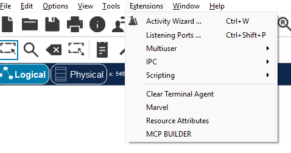
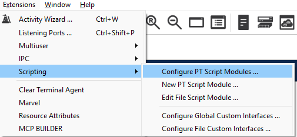
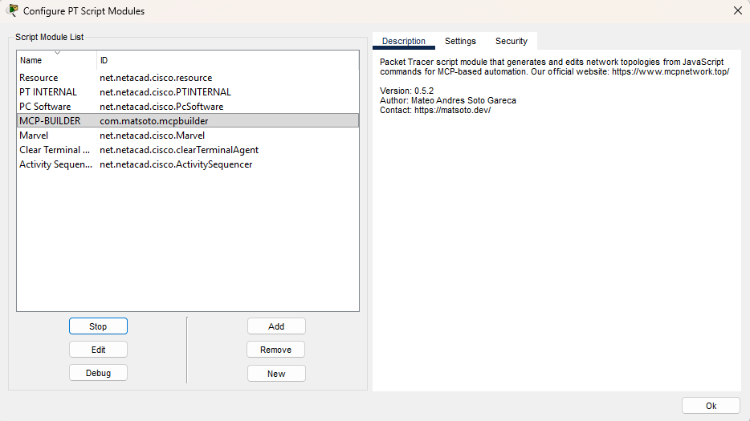

# Setup lengkap

## 1. Install server MCP

```powershell
pip install packet-tracer-mcp
python -c "import packet_tracer_mcp; print('ok')"
```

Butuh Python 3.11+. Cek dengan `python --version`.

## 2. Pasang extension di Packet Tracer

> Wajib V5: server versi 0.6.0+ tidak mau bicara dengan extension lama.
> File-nya sudah ada di repo ini: [`extensions/V5.2.pts`](../extensions/V5.2.pts)
> (atau download terbaru dari
> [releases MCP-Packet-Tracer](https://github.com/Mats2208/MCP-Packet-Tracer/releases/latest)).

1. Di Packet Tracer: **Extensions → Scripting → Configure PT Script Modules → Add…**
   → pilih file `.pts` tadi.

   
   

2. Pastikan **MCP-BUILDER** muncul di daftar Script Module List, lalu OK.

   

3. Buka **Extensions → MCP BUILDER** (connect otomatis, tidak perlu setting apa-apa).

## 3. Daftarkan server ke AI client Anda

Lihat tabel di [README](../README.md) + contoh file di [`configs/`](../configs/).
Ganti `python` dengan path absolut kalau `python` tidak dikenal di terminal Anda
(contoh Windows: `C:\Python313\python.exe`).

## 4. Tes koneksi

Tanya ke AI Anda:

> *"cek pt_bridge_status"*

Hasil yang diharapkan:

- `CONNECTED por HTTP` — jendela MCP BUILDER terbuka (tercepat, ada panel log).
- `CONNECTED por file-bridge` — jendela tertutup tapi PT masih jalan (bisa dipakai,
  sedikit lebih lambat).

Kalau `tidak terhubung`: pastikan PT terbuka + extension V5 terpasang,
lalu ulangi. Restart AI client kalau config baru saja ditambahkan
(config global dibaca saat start).

## Troubleshooting singkat

| Gejala | Penyebab umum |
|---|---|
| `ModuleNotFoundError: packet_tracer_mcp` | `pip install` belum jalan di Python yang dipakai client |
| Bridge tidak connected | Extension V5 belum di-Add, atau PT belum dibuka |
| Ping pertama gagal lalu OK | Normal: ARP belum resolved, ulangi ping |
| DHCP client dapat IP di luar pool | Pool di Server0 (Services → DHCP) belum diubah → ubah Start IP + Save, lalu `ipconfig /renew` di client |
| Pool bawaan `serverPool` tidak bisa dihapus | Normal di PT — ubah isinya (jangan dilawan), hapus pool tambahan saja |
